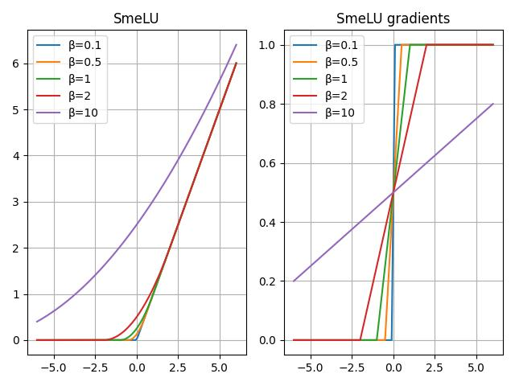

# Smooth ReLU in TensorFlow

<p align="center">
    
</p>

Unofficial **TensorFlow** reimplementation of the Smooth ReLU (SmeLU) activation function proposed in the
paper [Real World Large Scale Recommendation Systems Reproducibility and Smooth Activations](https://arxiv.org/pdf/2202.06499.pdf)
by Gil I. Shamir and Dong Lin.

**This repository includes an easy-to-use pure TensorFlow implementation of the Smooth ReLU.**

## Installation

The SmeLU can be installed by using `pip`.

````shell script
pip install git+https://github.com/r3v1/tf-SmeLU
````

## Example Usage

````python
import tensorflow as tf
from tf_smelu import smelu

x = tf.range(-6, 6, 1, dtype=float)  # <tf.Tensor: numpy=array([-6., -5., -4., -3., -2., -1.,  0.,  1.,  2.,  3.,  4.,  5.], dtype=float32)>

smelu(x, beta=0.1)  # <tf.Tensor: numpy=array([0.,0.,0.,0.,0.,0.,0.025,1.,2.,3.,4.,5.], dtype=float32)>
smelu(x, beta=0.5)  # <tf.Tensor: numpy=array([0.,0.,0.,0.,0.,0.,0.125,1.,2.,3.,4.,5.], dtype=float32)>
smelu(x, beta=1.)   # <tf.Tensor: numpy=array([0.,0.,0.,0.,0.,0.,0.25 ,1.,2.,3.,4.,5.], dtype=float32)>
````

The SmeLU takes the following parameters.

- `beta`: Half-width of a symmetric transition region around x = 0. Defaults to 1.

## Reference

````bibtex
@article{Shamir2022,
        title={{Real World Large Scale Recommendation Systems Reproducibility and Smooth Activations}},
        author={Shamir, Gil I and Lin, Dong},
        journal={{arXiv preprint arXiv:2202.06499}},
        year={2022}
}
````
